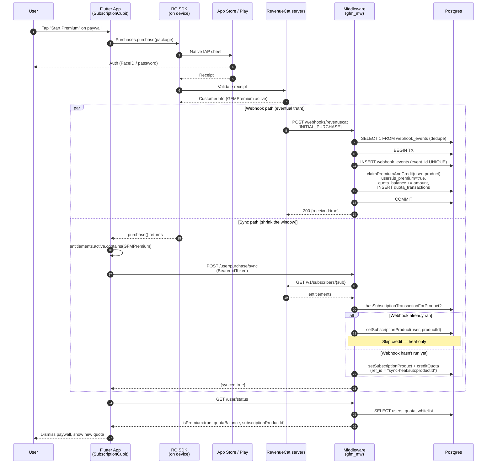
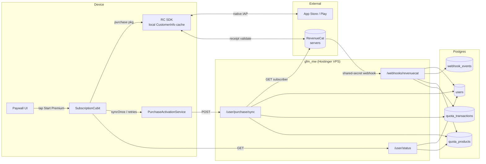

# Purchase Flow — App ↔ Middleware

**Status:** Reference doc (matches code as of 2026-05-24, post-migration 007 hardening). Earlier §7 items resolved by 007 + `application/rc-webhook/apply-event.ts`; remaining items listed under §7 *Outstanding*. §6.1 / §6.3 / §6.4 rewritten 2026-05-24 to correct stale `premium_reset_at` claims and document the new watermark + orphan-replay paths.
**Scope:** End-to-end trace of a paid subscription purchase, from the Flutter paywall through the RevenueCat SDK and the GFM middleware, to the point where the app sees `isPremium=true` and quota on `/user/status`.
**Companion doc:** `revenuecat-webhook-map.md` — per-event handler internals. This doc covers the wider system and points at that one for webhook details.

---

## 1. Components

| Layer | Component | File |
|---|---|---|
| App | Paywall UI | `lib/features/paywall/presentation/pages/paywall_page.dart` |
| App | `SubscriptionCubit` (purchase orchestration) | `lib/features/paywall/presentation/cubit/subscription_cubit.dart` |
| App | `SubscriptionService` (RC SDK wrapper) | `lib/features/paywall/data/services/subscription_service.dart` |
| App | `PurchaseActivationService` (backend reconcile) | `lib/features/paywall/data/services/purchase_activation_service.dart` |
| App | `NotificationsApi.syncPurchase` (HTTP client) | `lib/features/notifications/data/datasources/notifications_api.dart:82` |
| External | RevenueCat servers + Apple/Play billing | n/a |
| MW | `POST /webhooks/revenuecat` | `gfm_mw/src/presentation/routes/webhook.routes.ts:138` |
| MW | `POST /user/purchase/sync` | `gfm_mw/src/presentation/routes/user.routes.ts:66` |
| MW | `GET /user/status` | `gfm_mw/src/presentation/routes/user.routes.ts:15` |
| DB | `users`, `quota_products`, `quota_transactions`, `webhook_events` | `gfm_mw/migrations/001_init.sql`, `004_quota_system.sql` |

**Entitlement ID:** `GFMPremium`
**Product IDs:** `GFM_Weekly_3.99`, `GFM_Monthly_4.99`, `GFM_Yearly_44.99` (renamed in migration `005`)
**User identifier across layers:** Google `sub` claim from sign-in — used as RC `app_user_id`, as `users.google_sub`, and in JWT auth.

---

## 2. Identity bootstrap

Happens once per sign-in, before any purchase.

```
main.dart:21          SubscriptionService.configure()              ─► RC SDK ready
sign_in_cubit.dart:59 _subscriptionService.identifyUser(googleId)  ─► Purchases.logIn(sub)
sign_in_cubit.dart:97 _subscriptionService.clearUser()             ─► Purchases.logOut() on sign-out
```

After `identifyUser`, the RC `app_user_id` equals `users.google_sub` in the middleware DB. This is what links every later webhook event back to a row in `users` (`webhook.routes.ts:207` → `findByGoogleSub`).

Middleware-side, the row is upserted on the first authenticated request (`auth.middleware.ts` — `userRepo.upsert(sub, email)`), so RC sending a webhook for a brand-new user before they hit any other endpoint is the one race the system tolerates: `findByGoogleSub` returns null, the event is stored with `user_id = null` for audit, and we ack 200 (see `revenuecat-webhook-map.md §4.5`).

---

## 3. Happy-path sequence



The two paths in the `par` block race; **whichever finishes first commits the credit; the other becomes a no-op.** This is the core invariant — see §6.1.

---

## 4. Architecture (data flow)



Notice every write path (`WH`, `Sync`) goes through the **same** `PgUserRepository` methods (`claimPremiumAndCredit`, `creditQuota`, `setSubscriptionProduct`). Two callers, one set of mutations — the heal-only guard in `Sync` is what keeps them safe (`user.routes.ts:129-138`).

---

## 5. Step-by-step (with file references)

### 5.1 App initiates purchase

1. `paywall_page.dart` — user taps a package; calls `subscriptionCubit.purchase(package)`.
2. `subscription_cubit.dart:38-68` — `purchase(package)`:
   - emits `SubscriptionPurchasing`
   - awaits `SubscriptionService.purchase(package)` (`subscription_service.dart:31-34`) which calls `Purchases.purchase()`
   - checks `info.entitlements.active.containsKey('GFMPremium')`
   - if active, calls `_reconcileWithBackend()` then `_fetchBackendProductId()`
   - emits `SubscriptionLoaded(isPremium: true, currentProductId: <backend>, justPurchased: true)`

The RC SDK call blocks until App Store / Play finishes the transaction and RevenueCat validates the receipt. Around the time `purchase()` resolves locally, RevenueCat is **already** fanning out a webhook to the middleware in parallel.

### 5.2 App reconciles with backend

`subscription_cubit.dart:95-98` → `purchase_activation_service.dart:27-34`:

- **Foreground:** one `POST /user/purchase/sync` call. Awaited so the paywall doesn't dismiss until at least one attempt succeeded or failed.
- **Background fallback:** if `syncOnce()` fails, `startBackgroundRetries()` fires at +5s, +15s, +30s, +60s (`purchase_activation_service.dart:64-80`). `isActivating` `ValueNotifier` toggles for the dashboard banner.

`reconcileIfClientPremium()` (`:41-47`) is a second entry point used by gated screens (e.g., AI builder) — if the RC SDK reports premium but the backend doesn't, run the same dance.

### 5.3 RevenueCat hits the middleware

`webhook.routes.ts:138-264`, mirrored in `revenuecat-webhook-map.md`:

1. `rcIpLimitMiddleware` — IP-based rate limit
2. Shared-secret check — constant-time compare of the `Authorization` header against `env.RC_WEBHOOK_SECRET` via `crypto.timingSafeEqual` (lines 148-169). This is a static bearer token, **not** an HMAC of the body — see §7.
3. Parse envelope — 400 if `event.id` / `event.type` missing
4. **Fast dedupe** — `webhookRepo.existsById(event.id)`; if present, ack 200 silently
5. **User resolution** — `userRepo.findByGoogleSub(event.app_user_id)`; if null, store with `user_id=null` and ack
6. **Transactional apply** — `withTransaction(tx => { insertIfAbsent + applyEvent })`. INSERT with UNIQUE constraint on `event_id` is the authoritative dedupe guard; concurrent duplicates throw `DuplicateEventError` and ack silently
7. Metrics: `rcWebhookTotal{outcome}`, `rcWebhookLagMs` (now − `purchased_at_ms`)

For the **purchase flow specifically**, the relevant handler is `INITIAL_PURCHASE` (`webhook.routes.ts:55-67`):

```ts
case "INITIAL_PURCHASE": {
  const product = await productRepo.getById(event.product_id);
  await userRepo.claimPremiumAndCredit(
    userId, product.quotaAmount, product.productId, "subscription", event.id,
  );
}
```

`claimPremiumAndCredit` is the atomic primitive — its CTE sets `is_premium=true`, sets `subscription_product_id`, increments `quota_balance` by `product.quotaAmount`, and inserts a `quota_transactions` row with `source='subscription'` and `ref_id=event.id`. The whole operation is one SQL statement, wrapped together with the `webhook_events` INSERT inside `withTransaction(...)` at `webhook.routes.ts:222-231`.

Other webhook flows that share this code path but bypass the paywall purchase sequence:

- **`NON_RENEWING_PURCHASE`** (consumable / one-shot top-up): `creditQuota(..., "topup", ...)`. Does not touch `is_premium` or `subscription_product_id` — top-ups grant balance without conferring premium status.
- **`RENEWAL`, `PRODUCT_CHANGE`, `EXPIRATION`, `REFUND`, `BILLING_ISSUE`, `TRANSFER`, `CANCELLATION`** — see `revenuecat-webhook-map.md §3` for handler internals.

### 5.4 App's parallel `/user/purchase/sync` call

`user.routes.ts:66-145`:

1. `authMiddleware` — validates Google ID token (Bearer), upserts user, sets `req.user`
2. `syncUserLimitMiddleware` — per-user rate limit
3. Requires `env.RC_SECRET_API_KEY` — 503 if missing
4. `GET https://api.revenuecat.com/v1/subscribers/{googleSub}` with the RC secret key (server-to-server lookup, not webhook payload)
5. Reads `subscriber.entitlements["GFMPremium"]`; if not active / expired → `{synced:false}`
6. `setSubscriptionProduct(user, productId)` — always runs
7. **Heal-only credit** (lines 129-138):
   ```ts
   const hasSubscriptionTx = await userRepo.hasSubscriptionTransactionForProduct(
     user.id, product.productId,
   );
   if (!hasSubscriptionTx) {
     await userRepo.creditQuota(...source="subscription", refId=`sync-heal:${sub}:${productId}`);
   }
   ```
   If the webhook already inserted a `quota_transactions` row with `source='subscription'` and this product, skip. Otherwise credit.
8. Returns `{synced:true}` (or `synced:false` for "RC says not active").

### 5.5 App reads new state

`subscription_cubit.dart:100-103` calls the `GetUserStatus` usecase which hits `GET /user/status`. The cubit overrides the RC SDK's product ID with the backend's — `subscription_cubit.dart:46-48` comment notes the RC SDK can leak across Google accounts that share an Apple ID, so the backend is authoritative.

`/user/status` returns:
- `isPremium` — from `req.user.tier === "premium"` (set by auth middleware based on `users.is_premium` OR `quota_whitelist`)
- `quotaBalance` — `users.quota_balance`
- `subscriptionProductId` — `users.subscription_product_id`
- `gracePeriodUntil`, `youtubeMinutes*`, `unlimited`

---

## 6. Concurrency, dedupe, and ordering

### 6.1 Two writers, one credit — the heal-only guard

Webhook and sync can both fire for the same purchase. The dedupe story:

| Webhook insert in `quota_transactions` | Sync check `hasSubscriptionTransactionForProduct` | Sync action |
|---|---|---|
| `(source='subscription', product_id=X)` exists | true | Skip credit (still updates `subscription_product_id`) |
| Doesn't exist yet | false | Credit with `ref_id='sync-heal:sub:productId'` |

Both writers converge to exactly one credit because each path has its own guard:

- **Webhook first:** `claimPremiumAndCredit` atomically flips `is_premium=false → true` and writes `(source='subscription', ref_id=event.id)` in one CTE. Idempotent at the RC layer via the `webhook_events.event_id` UNIQUE constraint. Sync arrives, sees the row via `hasSubscriptionTransactionForProduct`, skips the credit (still re-asserts `subscription_product_id`).
- **Sync first:** `setSubscriptionProduct(user, productId)` sets `is_premium = TRUE` (its UPDATE uses `is_premium = ($2::text IS NOT NULL)`, see `pg-user.repository.ts:127-135`). Sync then writes `(source='subscription', ref_id='sync-heal:...')`. When the webhook arrives, `claimPremiumAndCredit`'s `WHERE id = $1 AND is_premium = FALSE` guard matches **zero rows** (`pg-user.repository.ts:148-165`), so the chained `INSERT INTO quota_transactions ... SELECT FROM claimed` also produces zero rows. No double credit.

The `is_premium=FALSE` guard inside `claimPremiumAndCredit` is what makes this safe — it is not a comment-level convention but a SQL-enforced precondition. See `pg-user.repository.ts:144-147` for the rationale comment that mirrors this section.

> **Caveat — only safe for INITIAL_PURCHASE.** The guard relies on `is_premium` being `FALSE` at the moment the webhook arrives. It does **not** protect RENEWAL, PRODUCT_CHANGE, or NON_RENEWING_PURCHASE — those handlers call `creditQuota` directly, which has no idempotency guard beyond the outer `webhook_events.event_id` UNIQUE. See §7.

### 6.2 Webhook dedupe

`webhook_events.event_id` UNIQUE + transactional `INSERT ... ON CONFLICT DO NOTHING` + `DuplicateEventError` rollback. Full mechanism in `revenuecat-webhook-map.md §2 step 3, step 6` and `§4.2`.

### 6.3 Out-of-order events — watermark-guarded

RC guarantees at-least-once, not order. Migration `007_event_watermark_and_dedupe.sql` added `users.last_event_at`, populated from `event.event_timestamp_ms` (or `purchased_at_ms` as fallback). Every RC-driven premium-state UPDATE in `pg-user.repository.ts` carries the guard:

```sql
AND (
  $ts::bigint IS NULL                       -- non-webhook caller (sync, free grant)
  OR last_event_at IS NULL                  -- never seen an event before
  OR last_event_at < to_timestamp($ts / 1000.0)
)
```

with `last_event_at = COALESCE(to_timestamp($ts/1000.0), last_event_at)` on success. Effect on the previously-corrupting sequences:

| Sequence (logical order → physical delivery) | Outcome under watermark |
|---|---|
| `EXPIRATION` then late `INITIAL_PURCHASE` | Late INITIAL_PURCHASE fails the watermark check; no double credit, premium stays cleared |
| `REFUND` then late `RENEWAL` | `creditQuota` honors the partial UNIQUE on `(user_id, source, product_id, ref_id)` (dedup by `event.id`); `setSubscriptionProduct` fails the watermark — user stays revoked |
| `EXPIRATION` then late `PRODUCT_CHANGE` | `updateProductChange` + `setSubscriptionProduct` fail the watermark; no reactivation |

`/user/purchase/sync` passes `eventTimestampMs=null` so it is **neither subject to nor advances** the watermark — sync is a poll, not an event; its idempotency comes from `hasSubscriptionTransactionForProduct`.

### 6.4 Identity edge case — orphan replay on first sign-in

If a webhook arrives for an `app_user_id` not yet in `users.google_sub`, the event is stored with `user_id=null` and ack'd 200. When the user eventually signs in, `auth.middleware` upserts them and — when the row is **newly created** — fire-and-forget calls `replayOrphanedEvents(googleSub, userId)` (`application/rc-webhook/apply-event.ts`). That helper:

1. `SELECT * FROM webhook_events WHERE user_id IS NULL AND raw_payload->'event'->>'app_user_id' = $sub ORDER BY processed_at ASC`
2. For each orphan: open a transaction, run `applyEvent(tx, userId, event)`, then `UPDATE webhook_events SET user_id = $userId` to claim the row.
3. A failure on one orphan does not block the rest; the row stays `user_id=NULL` and a future replay can retry it.

This closes the previous gap where orphans depended on the next RC event or on `/user/purchase/sync` (which depends on `RC_SECRET_API_KEY`).

---

## 7. Known gaps and trade-offs

### Resolved in migration 007 + accompanying code change

- **Out-of-order delivery** — closed by `users.last_event_at` watermark on every premium-state UPDATE. See §6.3.
- **TRANSFER state inconsistency** — `transferFrom` now clears `subscription_product_id`; `transferTo` sets it from `event.product_id` when present. Receiver gets the entitlement but not a quota credit (transfer moves entitlement, not balance).
- **Orphan webhook replay** — `auth.middleware` calls `replayOrphanedEvents` on first sign-in. See §6.4.
- **`creditQuota` idempotency** — UNIQUE partial index on `quota_transactions(user_id, source, product_id, ref_id) WHERE ref_id IS NOT NULL`, with `ON CONFLICT DO NOTHING` on insert. Defense in depth on top of `webhook_events.event_id` UNIQUE.
- **`gracePeriodUntil` auto-clear** — RENEWAL handler calls `clearGracePeriod` after credit. REFUND's `revokeImmediately` already clears it.
- **`RC_SECRET_API_KEY` required in production** — `env.ts` `superRefine` adds the check; service fails at boot if missing.
- **Silent `INITIAL_PURCHASE` missing `product_id`** — now logs `rc_initial_purchase_missing_product_id` (error level) before short-circuiting.
- **Flutter sync swallows errors** — `PurchaseActivationService` now records both foreground and exhausted-background failures to Crashlytics with a `phase` tag.
- **Dead `setPremium` / `renewPremium` / `revokePremium`** — removed from `UserRepository` interface and `PgUserRepository`.

### Outstanding

1. **Webhook auth is a static shared secret (RC's standard, not a flaw).** `webhook.routes.ts` compares `req.headers.authorization` against `env.RC_WEBHOOK_SECRET` with `timingSafeEqual`. RC does not publish a body-HMAC scheme — the bearer-style shared secret is their documented integration. Mitigations are operational, not code:
   - **TLS-only ingress** (already enforced via Nginx).
   - **Rotate `RC_WEBHOOK_SECRET` quarterly** and immediately on any incident.
   - **Never log the value** — confirmed today; Pino's redaction list should explicitly include `req.headers.authorization` as belt-and-braces.
   - **Sentry `beforeSend`** should scrub authorization headers.

2. **Per-IP rate limit on `/webhooks/revenuecat` can throttle legitimate RC traffic.** RC sends from a small IP pool. A promo-day burst of INITIAL_PURCHASE events arrives from the same few IPs and can trip `rcIpLimitMiddleware`. RC will retry, but the limit costs latency on launch day. Consider exempting requests whose `Authorization` matches `RC_WEBHOOK_SECRET` from the IP limit, or raising the cap substantially.

3. **Sandbox events credit real quota in production — intentional pre-launch.** The webhook route processes sandbox events identically to production (no gate). Acceptable while the user base is solo / the developer; **must be re-gated before opening the app to public sign-ups** so external sandbox Apple IDs can't credit real quota. Reintroduction options: env flag (`RC_ALLOW_SANDBOX=false`) or strict `env.NODE_ENV === "production"` check. See `webhook.routes.ts` around the "Sandbox events are processed identically" comment for the drop site.

4. **Sandbox product ID drift.** Migration `005` renamed product IDs to match the live store. Sandbox tooling that still uses the old `gfm_weekly` / `gfm_monthly` IDs hits `productRepo.getById` returning null and logs `rc_webhook_unknown_product`. No DB write; webhook is ack'd 200. Worth knowing during testing.

5. **`/user/purchase/sync` has no HTTP-level test.** Vitest + supertest are now wired (`npm test` — 30 cases covering repository SQL, applyEvent per event type, orphan replay, and webhook HTTP). The sync endpoint specifically isn't covered because mocking RC's `/v1/subscribers/{sub}` API is more test plumbing than the bug surface justifies — the heal-only decision logic is covered by the `hasSubscriptionTransactionForProduct` + `setSubscriptionProduct` repository tests. Add an HTTP test the next time the sync handler grows non-trivial branches.

---

## 8. Observability quick reference

| Signal | Where | Notes |
|---|---|---|
| `rc_webhook_processed` log | `webhook.routes.ts:249` | Success — includes `webhook_lag_ms` |
| `rc_webhook_duplicate_skipped` | `webhook.routes.ts:198` | Idempotency working |
| `rc_webhook_unknown_user` | `webhook.routes.ts:213` | Identity drift — investigate |
| `rc_webhook_unknown_product` | `webhook.routes.ts:59,72,83,115` | Product ID drift — check `quota_products` |
| `rc_webhook_transaction_failed` | `webhook.routes.ts:240` | Returns 503 → RC retries |
| `rc_sync_premium_granted` | `user.routes.ts:135` | Sync healed an uncredited purchase |
| `rc_sync_already_credited` | `user.routes.ts:137` | Sync detected webhook ran first (expected) |
| `rc_sync_no_active_entitlement` | `user.routes.ts:100` | RC says user is not entitled |
| `rc_sync_fetch_failed` | `user.routes.ts:84` | RC subscriber API returned non-2xx — sync returns 502, app retries |
| `rc_sync_unknown_product` | `user.routes.ts:117` | RC reports a product ID not in `quota_products` — product-catalog drift |
| `rc_initial_purchase_missing_product_id` | `application/rc-webhook/apply-event.ts` | INITIAL_PURCHASE arrived with no `product_id` — RC config drift |
| `rc_webhook_orphan_replay_start` | `application/rc-webhook/apply-event.ts` | First sign-in: replaying N orphan events for this user |
| `rc_webhook_orphan_replayed` | `application/rc-webhook/apply-event.ts` | Single orphan event applied successfully |
| `rc_webhook_orphan_replay_failed` | `application/rc-webhook/apply-event.ts` | One orphan failed; row stays `user_id=NULL` for retry |
| `rcWebhookTotal{event_type, outcome}` | Prometheus | Counter |
| `rcWebhookLagMs` | Prometheus | now − `purchased_at_ms`; tail latency = webhook delay |

---

## 9. Cross-references

- `docs/revenuecat-webhook-map.md` — per-event handler details, sandbox gate, transfer, out-of-order matrix
- `docs/api-contract.md` — request/response shapes for `/user/status`, `/user/purchase/sync`
- `gfm_mw/migrations/001_init.sql` — `users`, `webhook_events`
- `gfm_mw/migrations/004_quota_system.sql` — `quota_products`, `quota_transactions`, `quota_whitelist`
- `gfm_mw/migrations/005_rename_subscription_products.sql` — current product IDs
